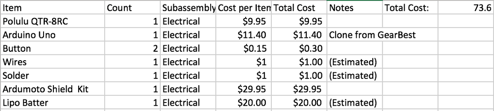
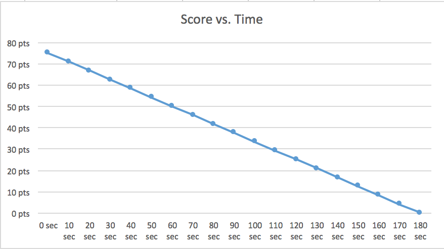
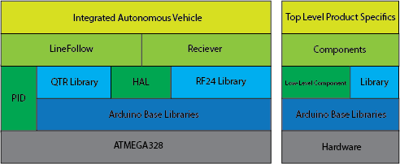
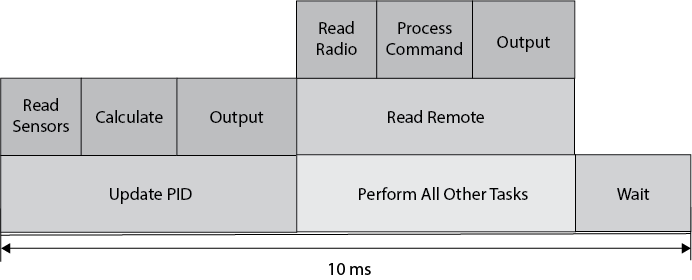
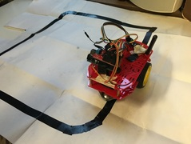

# tsa-iav-2016

This repository contains the work completed for the Technology Student Association (TSA) Integrated Autonomous Vehicle (IAV) competition for my team in 2016. The competition consisted of having a robot complete a course. Points were awarded for speed and completion of additional challenges. Points were subtracted for cost.
## Hardware
The software relies on custom hardware developed using the Arduino Uno platform and standalone ATmega328. See the docs folder for custom hardware designs and the `/docs` folder. Electrical designs are in the `/hardware` folder.

### Bill of Materials (BOM)

[Click Here to Download BOM](docs/BOM.csv)

### Score over Time

In the TSA IAV competition, one of the largest contributing factors to score is time.

While this is pretty straight-forward, the effect of time on the Integrated Autonomous Vehicle (IAV) cannot be overlooked. The score decreases over time in a linear fashion. This shapes decisions made about the IAV because it must complete the course quickly in order to receive more points.

## Software
The software for the integrated autonomous vehicle is written using the Arduino platform. See the software folder in this repository for more. 

### Architecture

The Integrated Autonomous Vehicle utilizes multiple distinct programming layers allowing for abstraction, organization, and reusability. The final IAV code runs on top of line following and remote control receiver components that are non-specific to the specific task. These components were built on a low-level output hardware abstraction layer (HAL) insulates line following and remote control code from the underlying hardware specifics. PID is also abstracted into its own low-level component in order to allow for reusability. Low-level components and libraries run on top of the Arduino software platform, which runs on top of the ATMEGA328 process.

### Scheduling

Special care is taken to ensure that the PID loop runs at a precise interval of 10ms. This matters because it is impossible to tune the derivative component accurately if the time between error measurements is inconsistent. This is not an issue for a program where the main loop contains only a PID loop; however, the program also contains code to read from the radio receiver and to process commands. As a result, special care is taken to ensure consistent execution of the control loop.

### Control Theory

The line following algorithm utilizes a piece of control theory known as Proportional-Integral-Derivative (PID) control. The integral piece is not used in this application, so it is sometimes referred to as just PD control. The right describes the control loop in block-diagram form. Measured displacement from being centered on the line is used to calculate a difference in motor power between left and right motors. This is added to the initial speed for one motor and subtracted from the other in order to rotate the vehicle such that it veers back onto the line.

### System Flow Chart

## Mechanical

### Payload Retrieval Subassembly
This plan, designed for manufacturing using a laser engraver, is the first prototype of Version 1 of Concept 1 for Subassembly 1, the payload retrieval assembly. The large discs, subassemblies a1 and b1, are designed to be glued inside the edges of a 3" schedule 80 PVC pipe in order to allow for a servo and an axle to attach to the scoop. The axle pieces are designed to be glued together vertically to form a 0.5 in. diameter cylinder to form an axle to run from subassembly b1 to support 2. Supports 1a and 1b are designed to hold a RadioShack 2730766 servo. The horn of that servo shall be glued and screwed to subassembly a1. The screw hold tests exist to allow testing of various dimensions of screw holds in case the once centered in subassembly a1 is incorrectly sized. Support joint tests exist to test the dimensions of the sockets that the feet of the supports will be glued into on the main chassis. A 1x1 inch box is included to ensure proper scale throughout the manufacturing process.

#### Drawing

#### Laser engraver cutting plans

### Chasis
The chasis is the main mechanical component of the IAV. It consists of the motors and 

#### Prototype (Version 1)
Early prototypes that tested line following and remote control functionality utilized the SparkFun RedBot chassis. This allowed electronics to be easily attached to the chassis and for new concepts to be tested before designing and building a final chassis. The SparkFun RedBot was used in Version 1 of the robot with Version 1 of the Source Code in the run-off competition December 4th, 2015

#### Version 2
The second version of the IAV chassis solves all of the above problems with the first generation chassis. The design can be manufactured utilizing a laser engraver and any material strong enough to support the weight of the vehicle. It could in theory be manufactured using acrylic plastic, aluminum, or cardboard. This gives flexibility to fix the cost issue. The second generation chassis will ride fairly close to the ground. It is low enough to allow for the payload retrieval subassembly to capture a tennis ball from the pedestal while sitting on top. It does this by mounting wheels above the main chassis itself and effectively hanging from the center of the wheels.

Wheel bays are cut from the left and right of the vehicle. A front section is cut to allow for the line following sensor to be installed. Mounts for the motors and wheels are cut as small rectangles near the wheel bays. The top contains circular screw holes for a ball bearing to serve as a rear wheel, and rectangles are cut to mount the payload retrieval subassembly. This early revision contains an error in the sensor mount that cuts the screw holes for the sensor mount out of the chassis.

### Practice Courses

Early iterations of the IAV were tested on a track built exclusively to test line following. The course was far more portable and far smaller the the actual practice course. This course was primarily used to test early prototypes of a line following vehicle leading up to the December 4th, 2015 run offs.

A detailed replica of the the final course as detailed in the COTSA Call to Conference 2016 was created in order to test the vehicle. A replica was designed to use entirely 3/4" electrical tape on a large sheet of paper in order to provide accurate dimensions for line following as well as portability. The course can be rolled up in order to allow for easy transportation.

## Summary
Early prototypes that tested line following and remote control functionality utilized the SparkFun RedBot chassis. This allowed electronics to be easily attached to the chassis and for new concepts to be tested before designing and building a final chassis. The SparkFun RedBot was used in Version 1 of the robot with Version 1 of the Source Code in the run-off competition December 4th, 2015. A school chassis was used; however it carried some major issues.
The Chassis Retailed at over $35.00. This is unacceptable in the final design.
The Chassis was too high off of the ground to successfully collect the payload.
The line following sensor was only able to be attached utilizing a single screw in addition to hot glue.
The second version of the IAV chassis solves all of the above problems with the first generation chassis. The design can be manufactured utilizing a laser engraver and any material strong enough to support the weight of the vehicle. It could in theory be manufactured using acrylic plastic, aluminum, or cardboard. This gives flexibility to fix the cost issue. The second generation chassis will ride fairly close to the ground. It is low enough to allow for the payload retrieval subassembly to capture a tennis ball from the pedestal while sitting on top. It does this by mounting wheels above the main chassis itself and effectively hanging from the center of the wheels.
A laser cut plan was used for the second generation chassis. Wheel bays are cut from the left and right of the vehicle. A front section is cut to allow for the line following sensor to be installed. Mounts for the motors and wheels are cut as small rectangles near the wheel bays. The top contains circular screw holes for a ball bearing to serve as a rear wheel, and rectangles are cut to mount the payload retrieval subassembly. This early revision contains an error in the sensor mount that cuts the screw holes for the sensor mount out of the chassis.
The Integrated Autonomous Vehicle utilizes multiple distinct programming layers allowing for abstraction, organization, and reusability. The final IAV code runs on top of line following and remote control receiver components that are non-specific to the specific task. These components were built on a low-level output hardware abstraction layer (HAL) insulates line following and remote control code from the underlying hardware specifics. PID is also abstracted into its own low-level component in order to allow for reusability. Low-level components and libraries run on top of the Arduino software platform, which runs on top of the ATMEGA328 process.
Special care is taken to ensure that the PID loop runs at a precise interval of 10ms. This matters because it is impossible to tune the derivative component accurately if the time between error measurements is inconsistent. This is not an issue for a program where the main loop contains only a PID loop; however, the program also contains code to read from the radio receiver and to process commands. As a result, special care is taken to ensure consistent execution of the control loop.
The line following algorithm utilizes a piece of control theory known as Proportional-Integral-Derivative (PID) control. The integral piece is not used in this application, so it is sometimes referred to as just PD control. The right describes the control loop in block-diagram form. Measured displacement from being centered on the line is used to calculate a difference in motor power between left and right motors. This is added to the initial speed for one motor and subtracted from the other in order to rotate the vehicle such that it veers back onto the line.
